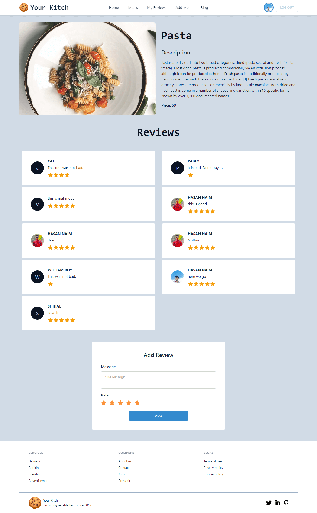

## Welcome YourKitch App 😊

<!-- what i used to build this website -->

This is a cloud kitchen website. Here you can add meals, you can review to others meals. You can edit those reviews or delete them.

### What I used to build this website

- React
- Tailwind
- React router dom
- daisyUi
- nodejs
- express
- mongodb
- firebase (authentication)

### What I learned from this project

- React js (how to manage state and work with them)
- how to work with tailwind css
- how to work with react router
- how to work in a fullstack application
- how to get data from a api
- how to create rest api and serve data
- how to store data in database
- how to get the data from database by using express
- learned crud operation
- learned some design
   
  _and many more_
   
   

<!-- visit the website -->

### [visit this website](https://your-kitch-ph-assignment-11.web.app/)

